## 구글 스프레드시트 연동

### 구글 개발자 콘솔 접속
```
https://console.developers.google.com/
```

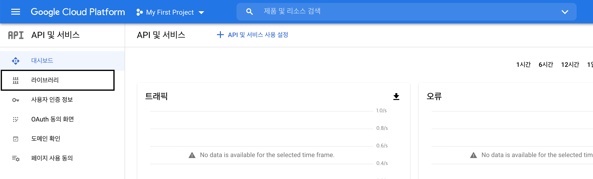

+ 라이브러리에 들어가서 Google Drive API로 검색을 한다.

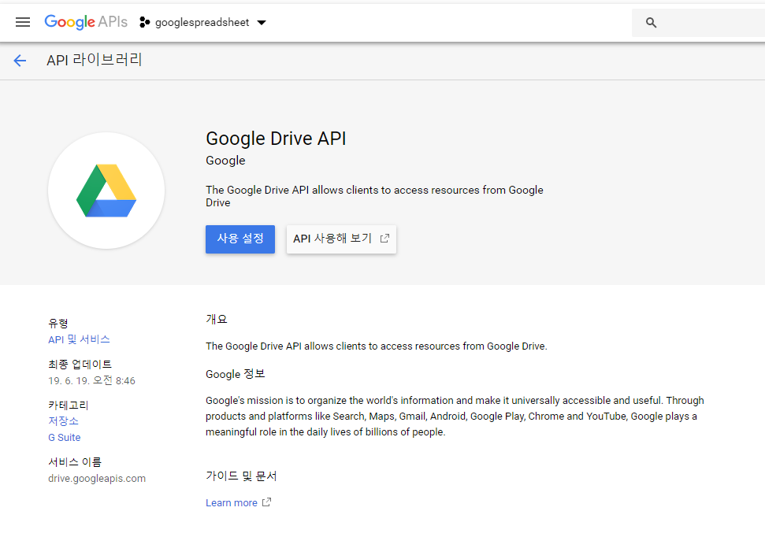

+ Google Drive API를 누르고 사용을 누른다.
+ Google Drive API관리를 누르면 아래와 우측 상단의 사용자 인증 정보 만들기를 클릭한다.

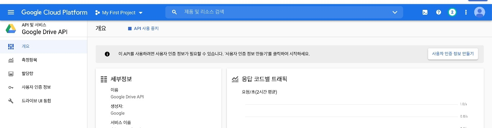

### 사용자 인증 정보
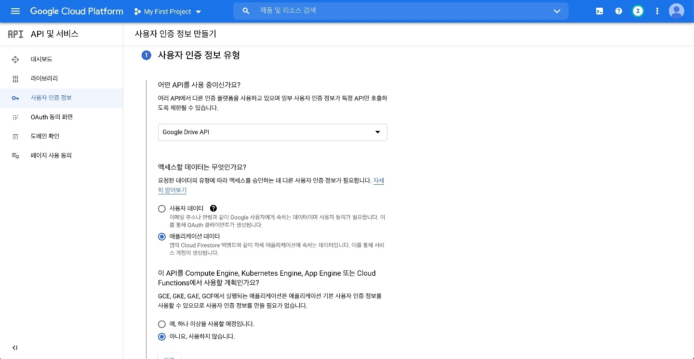
+ 사용자 인증 정보 유형은 위와 동일하게 설정해 줍니다.
+ 다음을 누르면 아래와 같이 서비스 계정을 만들어야 합니다.

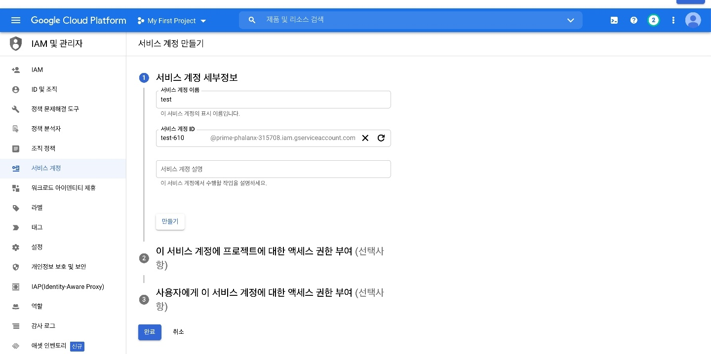
+ 해당 서비스 계정 이름은 임의대로 작성하시고 만들기를 누릅니다.

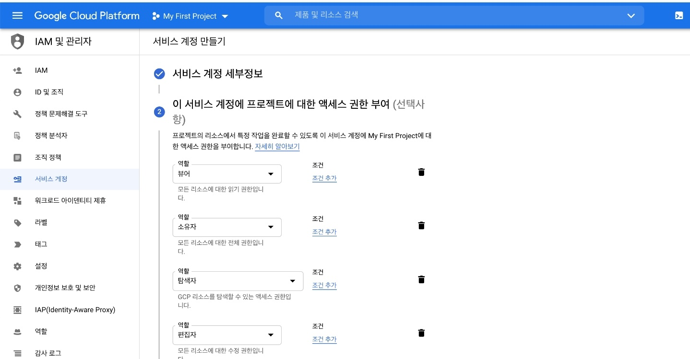
+ 역할 선택에서 기본에 뷰어, 소유자, 탐색자, 편집자 4가지 역할을 추가해 줍니다.
+ 그리고 완료를 누르면 됩니다.

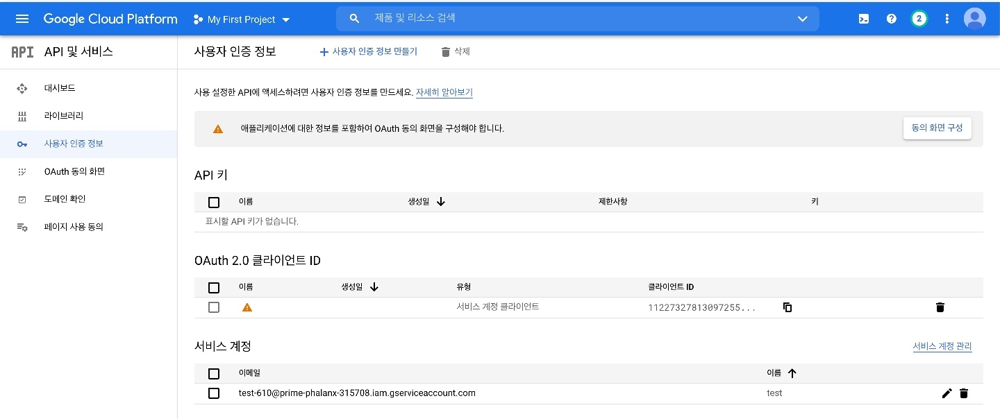
+ 생성된 서비스 계정의 이메일을 클릭하면 아래와 같은 페이지로 이동됩니다.

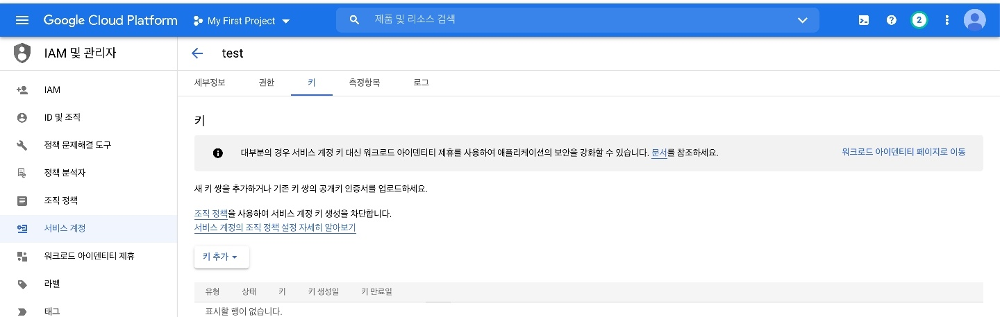
+ 상위 항목중 키를 클릭하시고 키추가를 해줍니다.

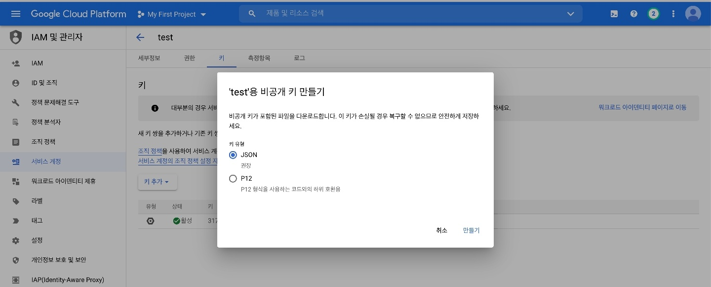
+ JSON으로 만들기를 누른다.

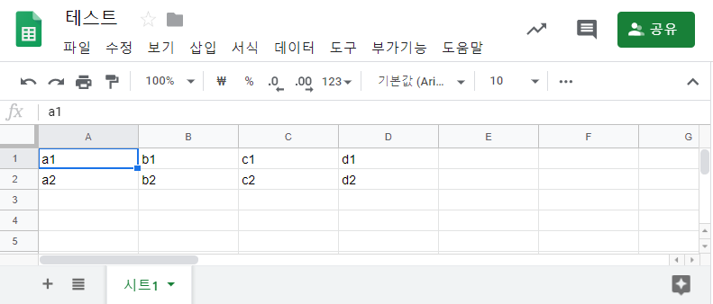
+ 앞으로 저장될 구글 스프레드 시트를 만드신 후 오른쪽 상단의 공유버튼을 누르시고

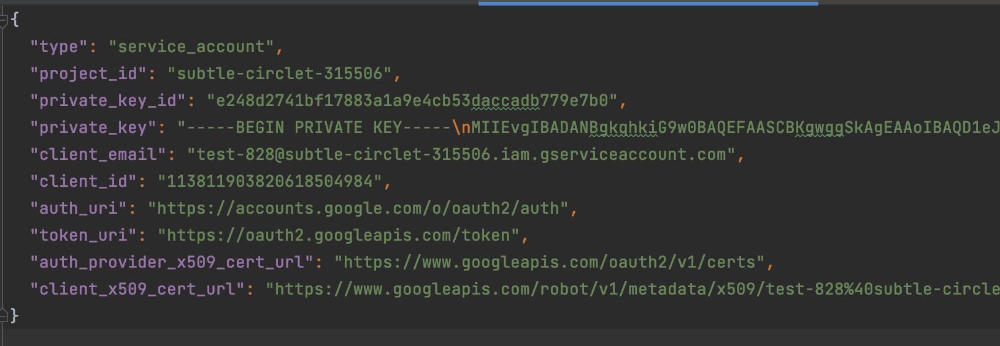
+ 아까 저장하였던 JSON파일을 열어보면 client_email이란 항목이 있는데 그 부분을 복사하여 아래와 같이 추가합니다. 

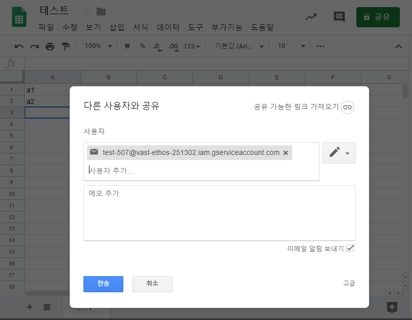
+ 해당 JSON파일과 구글 스프레드시트 URL정보만 주시면 설정완료